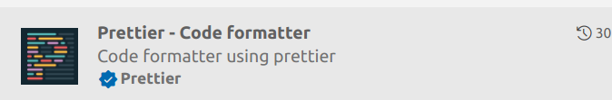
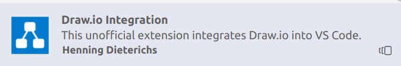
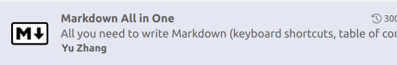

# S15_VSCode

Notes for using vscode efficently

1. [Best Extensions](#best-extensions)

## Best Extensions

| **1. Extensions for Editing**         |                                                                                                          |
| :------------------------------------ | :------------------------------------------------------------------------------------------------------- |
|    | `Ctrl+Shift+I` to insert date.                                                                           |
|    | Right-click a folder in Vscode explorer "Generate to Tree", to generate temporary text of the tree       |
|    | Offers more options than `file-tree-generator`. e.g. the max level of the tree (to avoid too lumpy text) |
|    | Formatter for VScode, turn off 'format on save' for better experience                                    |
| **2. Extensions for Graphic/Diagram** |                                                                                                          |
|    | A very nice Drwa.io in vscode                                                                            |
|    | Works the same way as Windows's `Paint`, but a little slower.                                            |
|    | Used when doing web developSment                                                                         |
| **3. Extensions for Markdown**        |                                                                                                          |
|    | Automatic TOC (table of content).                                                                        |
| **4. Web development**                |                                                                                                          |
|    | html/css/js playground                                                                                   |
